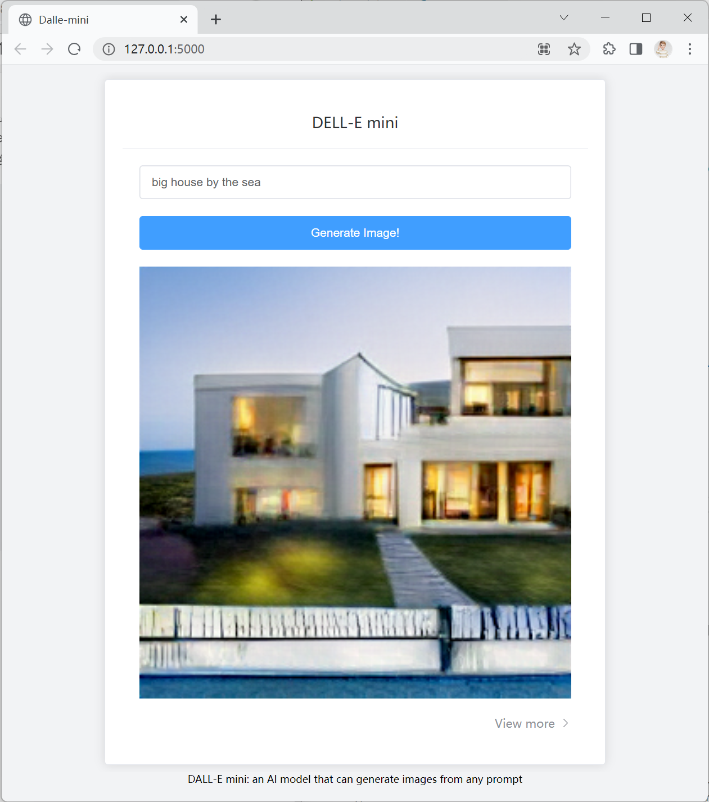

# ui-framework

It is a demo framework to show how to use `Vue` to establish a website. The demonstration is to generate an image using `Dalle-mini` by a piece of text prompt. 

The website looks like:



Please note that the repo is not a complete project, actually, it is only a front end, so you cannot run the website seperately to get the desired image. 

# how to run

## Project Setup

```sh
npm install
```

### Compile and Hot-Reload for Development

```sh
npm run dev
```

### Type-Check, Compile and Minify for Production

```sh
npm run build
```

# Citations

```bibtex
@misc{Dayma_DALL·E_Mini_2021,
      author = {Dayma, Boris and Patil, Suraj and Cuenca, Pedro and Saifullah, Khalid and Abraham, Tanishq and Lê Khắc, Phúc and Melas, Luke and Ghosh, Ritobrata},
      doi = {10.5281/zenodo.5146400},
      month = {7},
      title = {DALL·E Mini},
      url = {https://github.com/borisdayma/dalle-mini},
      year = {2021}
}
```
